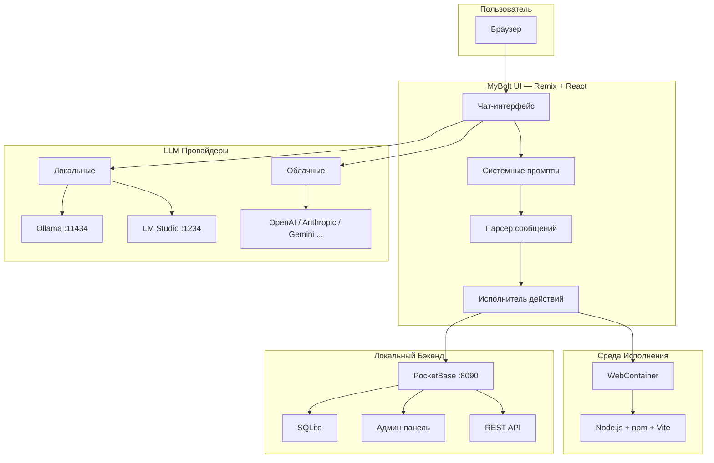

<div align="center">

<br>

```
 ★═══════════════════════════════════════════════════════════════════★
 ║                                                                   ║
 ║          ◈  M Y B O L T  ◈                                       ║
 ║          AI-Ассистент Веб-Разработки                              ║
 ║                                                                   ║
 ║          ✦  vibecoding.by  ✦                                      ║
 ║                                                                   ║
 ★═══════════════════════════════════════════════════════════════════★
```

<br>


<br>


<br><br>

> *Форк [bolt.diy](https://github.com/stackblitz-labs/bolt.diy), доработанный в рамках учебного курса*
> *школы [vibecoding.by](https://vibecoding.by)*

</div>

---

<div align="center">

### ◈ Навигация ◈

[Возможности](#-возможности) · [Архитектура](#-архитектура) · [Быстрый старт](#-быстрый-старт) · [PocketBase](#-pocketbase) · [Локальные модели](#-локальные-модели) · [Что сделано](#-что-сделано-в-рамках-курса)

</div>

---

## ✦ О проекте

**MyBolt** — AI-среда для full-stack веб-разработки прямо в браузере. Вы описываете что хотите — нейросеть генерирует полноценное приложение: HTML, CSS, JavaScript, React, Node.js, базу данных.

Ключевая особенность этого форка — **полная автономность**. Всё работает локально, без интернета: локальные LLM через Ollama/LM Studio, локальная база PocketBase, автоматическая настройка при первом запуске.

---

## ⚡ Возможности

<table>
<tr>
<td width="50%">

### 🧠 Нейросети
- Поддержка **15+ провайдеров** LLM
- **Локальные модели** — Ollama, LM Studio
- Облачные — OpenAI, Anthropic, Gemini, Groq, DeepSeek, Mistral, xAI, Cohere, Perplexity, OpenRouter, HuggingFace
- **Улучшение промптов** через AI
- Стриминг генерации кода в реальном времени

</td>
<td width="50%">

### 🗄️ Бэкенд
- **PocketBase** — локальная БД (SQLite + REST API)
- Авто-скачивание и авто-запуск
- Авто-создание superuser
- Автогенерация `pb-setup.js` для коллекций
- Работает **без интернета**

</td>
</tr>
<tr>
<td>

### 🛠️ Разработка
- Генерация полноценных веб-приложений
- Встроенный терминал
- Откат к предыдущим версиям кода
- Git-клонирование и импорт проектов
- Прикрепление изображений к промптам
- Экспорт проекта как ZIP

</td>
<td>

### 🚀 Деплой
- Деплой на **Netlify** из интерфейса
- Публикация на **GitHub**
- Docker-контейнеризация
- WebContainer — среда исполнения в браузере

</td>
</tr>
</table>

---

## 🔮 Архитектура



---

## 🚀 Быстрый старт

### Требования

| Компонент | Версия | Ссылка |
|-----------|--------|--------|
| **Node.js** | 18+ | [nodejs.org](https://nodejs.org/) |
| **pnpm** | Последняя | Устанавливается командой ниже |

### Установка

```bash
# Клонировать репозиторий
git clone https://github.com/antsincgame/boltby.git
cd boltby

# Установить менеджер пакетов
npm install -g pnpm

# Установить зависимости
pnpm install

# Запустить
pnpm run dev
```

### Что происходит при первом запуске

Скрипт `pre-start.cjs` автоматически выполняет:

```
 1. ◈ Скачивает PocketBase (если не установлен)
 2. ◈ Создаёт superuser (admin@bolt.local)
 3. ◈ Сохраняет credentials в .env.local
 4. ◈ Запускает PocketBase на порту 8090
 5. ◈ Запускает LM Studio (если установлен)
 6. ◈ Запускает dev-сервер на порту 5173
```

Откройте **http://localhost:5173** в браузере.

---

## 🗄️ PocketBase

PocketBase — локальный open-source бэкенд. Один бинарный файл, SQLite внутри, REST API, админ-панель, авторизация, подписки в реальном времени.

<table>
<tr>
<td><b>Компонент</b></td>
<td><b>Адрес</b></td>
</tr>
<tr>
<td>REST API</td>
<td><code>http://localhost:8090/api/</code></td>
</tr>
<tr>
<td>Админ-панель</td>
<td><code>http://localhost:8090/_/</code></td>
</tr>
<tr>
<td>Суперпользователь</td>
<td><code>admin@bolt.local</code> / <code>boltadmin2024</code></td>
</tr>
</table>

### Как это работает

Когда вы просите MyBolt создать приложение с базой данных, нейросеть автоматически:

1. Генерирует файл **`pb-setup.js`** — скрипт, который создаёт коллекции через API PocketBase
2. Добавляет в `package.json` скрипт запуска: `"dev": "node pb-setup.js && vite"`
3. Генерирует код приложения с использованием **PocketBase SDK**

Коллекции создаются автоматически при первом запуске — вручную ничего настраивать не нужно.

<details>
<summary><b>Пример сгенерированного pb-setup.js</b></summary>

```javascript
const PB_URL = process.env.VITE_POCKETBASE_URL || 'http://localhost:8090';

async function setup() {
  // Авторизация как суперпользователь
  const auth = await fetch(`${PB_URL}/api/collections/_superusers/auth-with-password`, {
    method: 'POST',
    headers: { 'Content-Type': 'application/json' },
    body: JSON.stringify({ identity: 'admin@bolt.local', password: 'boltadmin2024' }),
  });
  const { token } = await auth.json();
  const headers = { 'Content-Type': 'application/json', Authorization: token };

  // Проверка существующих коллекций
  const existing = await fetch(`${PB_URL}/api/collections`, { headers });
  const { items } = await existing.json();
  const names = items.map((c) => c.name);

  // Определение коллекций
  const collections = [
    {
      name: 'posts',
      type: 'base',
      schema: [
        { name: 'title', type: 'text', required: true },
        { name: 'content', type: 'editor' },
        { name: 'user', type: 'relation', options: { collectionId: '_pb_users_auth_', maxSelect: 1 } },
      ],
    },
  ];

  // Создание недостающих коллекций
  for (const col of collections) {
    if (names.includes(col.name)) continue;
    await fetch(`${PB_URL}/api/collections`, {
      method: 'POST',
      headers,
      body: JSON.stringify(col),
    });
  }
}

setup().catch(() => console.log('PocketBase не доступен, пропускаем настройку'));
```

</details>

---

## 🧠 Локальные модели

Для работы без интернета установите одну из локальных LLM-платформ:

### Ollama

```bash
# Установка (Linux/macOS)
curl -fsSL https://ollama.ai/install.sh | sh

# Скачать рекомендуемую модель
ollama pull qwen2.5-coder:14b
```

Ollama запускается автоматически. Доступен на `http://localhost:11434`.

### LM Studio

1. Скачайте с [lmstudio.ai](https://lmstudio.ai/)
2. Загрузите модель (рекомендуется **Qwen 2.5 Coder 14B**)
3. MyBolt автоматически запустит LM Studio при старте

### Настройка API-ключей (для облачных провайдеров)

1. Откройте интерфейс MyBolt
2. Выберите провайдер из выпадающего списка
3. Нажмите иконку карандаша рядом с полем ключа
4. Введите API-ключ

> Для локальных моделей API-ключи **не нужны**.

---

## 🐳 Docker

```bash
# Сборка
docker build . --target bolt-ai-development

# Запуск
docker compose --profile development up
```

---

## 📋 Скрипты

| Команда | Описание |
|---------|----------|
| `pnpm run dev` | Запуск dev-сервера |
| `pnpm run build` | Сборка проекта |
| `pnpm run preview` | Сборка + локальный запуск |
| `pnpm test` | Запуск тестов (Vitest) |
| `pnpm run typecheck` | Проверка типов TypeScript |
| `pnpm run lint:fix` | Автоисправление ошибок линтера |

---

## ✅ Что сделано в рамках курса

### Миграция на PocketBase

| Задача | Статус |
|--------|--------|
| Полное удаление Supabase (5 файлов, ~2000 строк) | Выполнено |
| Новый store `pocketbase.ts` с health-check | Выполнено |
| Новый API route `api.pocketbase.ts` с SSRF-защитой | Выполнено |
| Авто-скачивание бинаря PocketBase | Выполнено |
| Авто-создание superuser при первом запуске | Выполнено |
| Обновление 4 системных промптов для PocketBase | Выполнено |
| Инструкции для LLM по генерации `pb-setup.js` | Выполнено |

### Безопасность

| Задача | Статус |
|--------|--------|
| Устранение SSRF-уязвимости в API route | Выполнено |
| Whitelist разрешённых API-путей | Выполнено |
| Валидация HTTP-методов | Выполнено |
| Защита от race condition в health-check | Выполнено |
| Обработка unhandled promise rejection | Выполнено |

### Оптимизация производительности

| Задача | Статус |
|--------|--------|
| `AssistantMessage.tsx` — O(n²) → O(n) через Map | Выполнено |
| `Chat.client.tsx` — мемоизация useCallback/useMemo | Выполнено |
| `Messages.client.tsx` — стабильные key (messageId) | Выполнено |
| Исправление типизации в `message-parser.ts` | Выполнено |
| Удаление debug-логирования из production | Выполнено |
| Настройка автозапуска LM Studio | Выполнено |

---

## 📁 Структура проекта

```
MyBolt/
│
├── app/
│   ├── components/           React-компоненты
│   │   ├── @settings/        Настройки, подключения, диагностика
│   │   └── chat/             Чат, сообщения, алерты
│   │
│   ├── lib/
│   │   ├── .server/llm/      Серверная логика стриминга LLM
│   │   ├── common/prompts/   Системные промпты (4 варианта)
│   │   ├── hooks/            React-хуки
│   │   ├── modules/llm/      Провайдеры LLM (15+ штук)
│   │   ├── persistence/      Хранение чатов (IndexedDB)
│   │   ├── runtime/          Парсер сообщений, исполнитель действий
│   │   └── stores/           Nano-stores (pocketbase, workbench)
│   │
│   ├── routes/               API endpoints
│   │   ├── api.chat.ts       Главный endpoint чата
│   │   ├── api.enhancer.ts   Улучшение промптов
│   │   └── api.pocketbase.ts Прокси к PocketBase
│   │
│   └── types/                TypeScript-типы
│
├── pre-start.cjs             Авто-запуск PocketBase + LM Studio
├── .env.local                API-ключи (не коммитится!)
└── package.json
```

---

## 📜 Лицензия

Исходный код распространяется под лицензией **MIT**.

WebContainers API требует [отдельной лицензии](https://webcontainers.io/enterprise) для коммерческого использования.

---

<div align="center">

<br>

```
★═══════════════════════════════════════════════════════════════════★
║                                                                   ║
║   Проект школы vibecoding.by                                      ║
║   Преподаватель: Дмитрий Орлов                                    ║
║                                                                   ║
★═══════════════════════════════════════════════════════════════════★
```

<br>


<br><br>

*Создано с помощью AI, доработано с душой*

</div>
