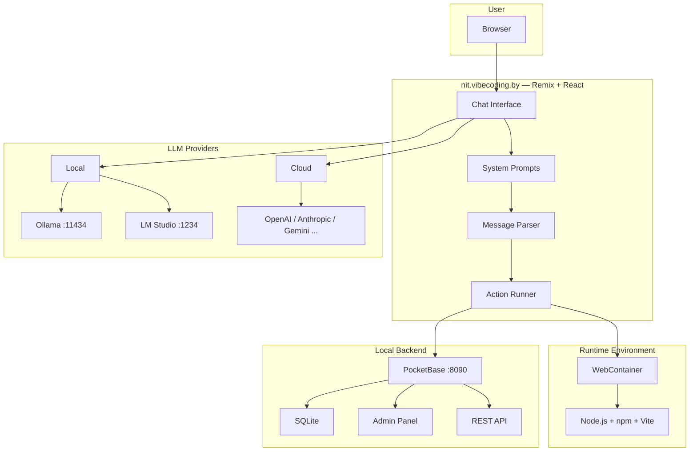

<div align="center">

<br>

```
 ★═══════════════════════════════════════════════════════════════════★
 ║                                                                   ║
 ║          ◈  N I T . V I B E C O D I N G . B Y  ◈                 ║
 ║          Belarusian AI-Powered Web Development                    ║
 ║                                                                   ║
 ║          ✦  Built in Belarus  ✦                                   ║
 ║                                                                   ║
 ★═══════════════════════════════════════════════════════════════════★
```

<br>


<br>


<br><br>

**A Belarusian AI assistant for full-stack web development — entirely in the browser.**

> Fork of [bolt.diy](https://github.com/stackblitz-labs/bolt.diy), enhanced at [vibecoding.by](https://vibecoding.by) school.
> Local-first. Offline-capable. Fully autonomous.

</div>

---

<div align="center">

### ◈ Navigation ◈

[Features](#-features) · [Architecture](#-architecture) · [Quick Start](#-quick-start) · [PocketBase](#-pocketbase) · [Local Models](#-local-models) · [What We Built](#-what-we-built) · [Project Structure](#-project-structure)

</div>

---

## ✦ About

**nit.vibecoding.by** is an AI-powered environment for full-stack web development right in your browser. Describe what you want — the neural network generates a complete application: HTML, CSS, JavaScript, React, Node.js, database and all.

The key differentiator of this fork is **full autonomy**. Everything runs locally, without internet: local LLMs via Ollama/LM Studio, local PocketBase database, automatic setup on first launch.

This project is developed as part of the educational program at **[vibecoding.by](https://vibecoding.by)** — a Belarusian school of AI-assisted development, led by instructor **Dmitry Orlov**.

---

## ⚡ Features

<table>
<tr>
<td width="50%">

### 🧠 Neural Networks
- Support for **15+ LLM providers**
- **Local models** — Ollama, LM Studio
- Cloud — OpenAI, Anthropic, Gemini, Groq, DeepSeek, Mistral, xAI, Cohere, Perplexity, OpenRouter, HuggingFace
- **Prompt enhancement** via AI
- Real-time code streaming

</td>
<td width="50%">

### 🗄️ Backend
- **PocketBase** — local DB (SQLite + REST API)
- Auto-download and auto-launch
- Auto-creation of superuser
- Auto-generation of `pb-setup.js` for collections
- Works **completely offline**

</td>
</tr>
<tr>
<td>

### 🛠️ Development
- Full-stack web app generation from text
- Integrated terminal
- Code version rollback
- Git clone and project import
- Image attachments in prompts
- Export project as ZIP

</td>
<td>

### 🚀 Deployment
- Deploy to **Netlify** from the UI
- Publish to **GitHub**
- Docker containerization
- WebContainer — in-browser runtime

</td>
</tr>
</table>

---

## 🔮 Architecture



---

## 🚀 Quick Start

### Requirements

| Component | Version | Link |
|-----------|---------|------|
| **Node.js** | 18+ | [nodejs.org](https://nodejs.org/) |
| **pnpm** | Latest | Installed via command below |

### Installation

```bash
# Clone the repository
git clone https://github.com/antsincgame/nit.vibecoding.by.git
cd nit.vibecoding.by

# Install package manager
npm install -g pnpm

# Install dependencies
pnpm install

# Launch (PocketBase downloads automatically)
pnpm run dev
```

### What Happens on First Launch

The `pre-start.cjs` script automatically:

```
 1. ◈ Downloads PocketBase (if not installed)
 2. ◈ Creates superuser (admin@bolt.local)
 3. ◈ Saves credentials to .env.local
 4. ◈ Starts PocketBase on port 8090
 5. ◈ Launches LM Studio (if installed)
 6. ◈ Starts dev server on port 5173
```

Open **http://localhost:5173** in your browser.

---

## 🗄️ PocketBase

PocketBase is a local open-source backend. Single binary, SQLite inside, REST API, admin panel, authentication, real-time subscriptions.

| Component | Address |
|-----------|---------|
| REST API | `http://localhost:8090/api/` |
| Admin Panel | `http://localhost:8090/_/` |
| Superuser | `admin@bolt.local` / `boltadmin2024` |

### How It Works

When you ask the AI to create an app with a database, it automatically:

1. Generates a **`pb-setup.js`** file — a script that creates collections via the PocketBase API
2. Adds a launch script to `package.json`: `"dev": "node pb-setup.js && vite"`
3. Generates application code using the **PocketBase SDK**

Collections are created automatically on first run — no manual configuration needed.

<details>
<summary><b>Example of generated pb-setup.js</b></summary>

```javascript
const PB_URL = process.env.VITE_POCKETBASE_URL || 'http://localhost:8090';

async function setup() {
  // Authenticate as superuser
  const auth = await fetch(`${PB_URL}/api/collections/_superusers/auth-with-password`, {
    method: 'POST',
    headers: { 'Content-Type': 'application/json' },
    body: JSON.stringify({ identity: 'admin@bolt.local', password: 'boltadmin2024' }),
  });
  const { token } = await auth.json();
  const headers = { 'Content-Type': 'application/json', Authorization: token };

  // Check existing collections
  const existing = await fetch(`${PB_URL}/api/collections`, { headers });
  const { items } = await existing.json();
  const names = items.map((c) => c.name);

  // Define collections
  const collections = [
    {
      name: 'posts',
      type: 'base',
      schema: [
        { name: 'title', type: 'text', required: true },
        { name: 'content', type: 'editor' },
        { name: 'user', type: 'relation', options: { collectionId: '_pb_users_auth_', maxSelect: 1 } },
      ],
    },
  ];

  // Create missing collections
  for (const col of collections) {
    if (names.includes(col.name)) continue;
    await fetch(`${PB_URL}/api/collections`, {
      method: 'POST',
      headers,
      body: JSON.stringify(col),
    });
  }
}

setup().catch(() => console.log('PocketBase not available, skipping setup'));
```

</details>

---

## 🧠 Local Models

To work without internet, install one of the local LLM platforms:

### Ollama

```bash
# Install (Linux/macOS)
curl -fsSL https://ollama.ai/install.sh | sh

# Download recommended model
ollama pull qwen2.5-coder:14b
```

Ollama starts automatically. Available at `http://localhost:11434`.

### LM Studio

1. Download from [lmstudio.ai](https://lmstudio.ai/)
2. Load a model (recommended: **Qwen 2.5 Coder 14B**)
3. The app automatically launches LM Studio on startup

### API Keys (for cloud providers)

1. Open the interface
2. Select a provider from the dropdown
3. Click the pencil icon next to the key field
4. Enter your API key

> For local models, **no API keys** are needed.

---

## 🐳 Docker

```bash
# Build
docker build . --target bolt-ai-development

# Run
docker compose --profile development up
```

---

## 📋 Scripts

| Command | Description |
|---------|-------------|
| `pnpm run dev` | Start dev server |
| `pnpm run build` | Build the project |
| `pnpm run preview` | Build + local preview |
| `pnpm test` | Run tests (Vitest) |
| `pnpm run typecheck` | TypeScript type checking |
| `pnpm run lint:fix` | Auto-fix linter errors |

---

## ✅ What We Built

### Migration to PocketBase

| Task | Status |
|------|--------|
| Full removal of Supabase (5 files, ~2000 lines) | Done |
| New store `pocketbase.ts` with health-check | Done |
| New API route `api.pocketbase.ts` with SSRF protection | Done |
| Auto-download of PocketBase binary | Done |
| Auto-creation of superuser on first launch | Done |
| Updated 4 system prompts for PocketBase | Done |
| LLM instructions for `pb-setup.js` generation | Done |

### Security

| Task | Status |
|------|--------|
| SSRF vulnerability fix in API route | Done |
| Whitelist of allowed API paths | Done |
| HTTP method validation | Done |
| Race condition protection in health-check | Done |
| Unhandled promise rejection fix | Done |

### Performance Optimization

| Task | Status |
|------|--------|
| `AssistantMessage.tsx` — O(n^2) to O(n) via Map | Done |
| `Chat.client.tsx` — memoization with useCallback/useMemo | Done |
| `Messages.client.tsx` — stable keys (messageId) | Done |
| Type fix in `message-parser.ts` | Done |
| Removed debug logging from production | Done |
| Auto-launch configuration for LM Studio | Done |

---

## 📁 Project Structure

```
nit.vibecoding.by/
│
├── app/
│   ├── components/           React components
│   │   ├── @settings/        Settings, connections, diagnostics
│   │   └── chat/             Chat, messages, alerts
│   │
│   ├── lib/
│   │   ├── .server/llm/      Server-side LLM streaming logic
│   │   ├── common/prompts/   System prompts (4 variants)
│   │   ├── hooks/            React hooks
│   │   ├── modules/llm/      LLM providers (15+)
│   │   ├── persistence/      Chat storage (IndexedDB)
│   │   ├── runtime/          Message parser, action runner
│   │   └── stores/           Nano-stores (pocketbase, workbench)
│   │
│   ├── routes/               API endpoints
│   │   ├── api.chat.ts       Main chat endpoint
│   │   ├── api.enhancer.ts   Prompt enhancement
│   │   └── api.pocketbase.ts PocketBase proxy
│   │
│   └── types/                TypeScript types
│
├── pre-start.cjs             Auto-launch PocketBase + LM Studio
├── .env.local                API keys (not committed!)
└── package.json
```

---

## 📜 License

Source code is distributed under the **MIT** license.

WebContainers API requires a [separate license](https://webcontainers.io/enterprise) for commercial use.

---

<div align="center">

<br>

```
★═══════════════════════════════════════════════════════════════════★
║                                                                   ║
║   A project by vibecoding.by                                      ║
║   Instructor: Dmitry Orlov                                        ║
║   Made in Belarus 🇧🇾                                              ║
║                                                                   ║
★═══════════════════════════════════════════════════════════════════★
```

<br>


<br><br>

*Built with AI. Perfected with soul.*

</div>
